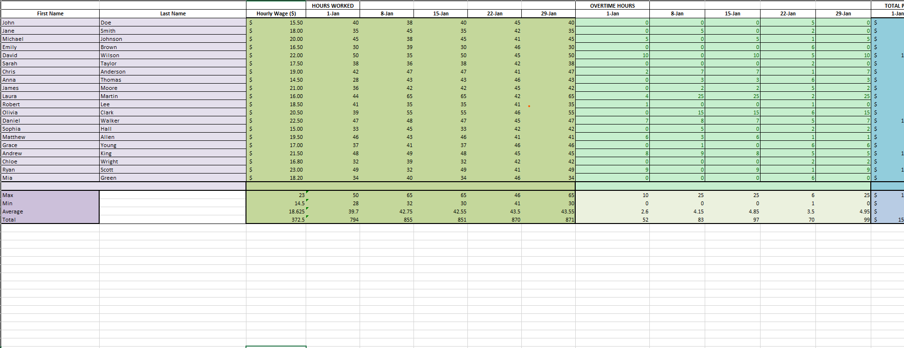

# Payroll Creation & Data Analysis

This project contains a simple payroll system created in Excel as part of my data analysis portfolio.  
It demonstrates skills in:
- Data cleaning
- Basic formulas (SUM, IF, etc.)
- Formatting for readability
- Payroll computation logic

## File
- **payroll.xlsx** → The main payroll sheet.

## Preview

